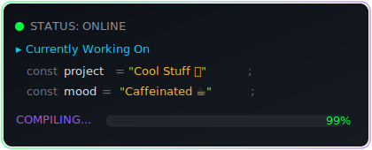

<div align="center">

<!-- HERO: Animated Terminal Header -->


<br/>

<!-- Typing SVG -->
<a href="https://git.io/typing-svg"></a>

<br/>

<!-- Animated Divider -->


</div>

<!-- ABOUT ME: Terminal Style -->
```bash
            ╔══════════════════════════════════════════════════════════════════╗
            ║                                                                  ║
            ║   ███╗   ██╗██╗ ██████╗██╗  ██╗       █████╗  ██████╗  ██████╗   ║
            ║   ████╗  ██║██║██╔════╝██║ ██╔╝      ██╔══██╗██╔═████╗██╔═████╗  ║
            ║   ██╔██╗ ██║██║██║     █████╔╝ █████╗╚█████╔╝██║██╔██║██║██╔██║  ║
            ║   ██║╚██╗██║██║██║     ██╔═██╗ ╚════╝██╔══██╗████╔╝██║████╔╝██║  ║
            ║   ██║ ╚████║██║╚██████╗██║  ██╗      ╚█████╔╝╚██████╔╝╚██████╔╝  ║
            ║   ╚═╝  ╚═══╝╚═╝ ╚═════╝╚═╝  ╚═╝       ╚════╝  ╚═════╝  ╚═════╝   ║
            ║                                                                  ║
            ╚══════════════════════════════════════════════════════════════════╝
```

<div align="center">

<!-- Status Widget -->


</div>

<br/>

## `> cat ./about_me.md` 

```js
const nick = {
    name: "Sohaib Kamash",
    alias: "Nick-800",
    role: "Full-Stack Developer & Mobile Engineer",
    location: "Building from anywhere",
    
    code: {
        languages:  ["PHP", "JavaScript", "TypeScript", "Dart", "Python"],
        frontend:   ["React", "Next.js", "Vite", "HTML5", "CSS3"],
        backend:    ["Laravel", "Node.js", "Express", "REST APIs"],
        mobile:     ["Flutter", "Dart"],
        databases:  ["MySQL", "PostgreSQL", "MongoDB", "Redis"],
        devOps:     ["Docker", "Git", "Linux", "CI/CD"],
        tools:      ["VS Code", "Figma", "Postman", "Android Studio"]
    },
    
    currentFocus: "Building production-grade web & mobile applications",
    funFact: "I debug with coffee and deploy with confidence"
};
```

<div align="center">

<br/>

<!-- Animated Divider -->


<br/>

## `> ls ./tech_arsenal/`

<br/>

<!-- Languages -->


<br/>

<!-- Frameworks & Libraries -->


<br/>

<!-- Databases & Tools -->


<br/><br/>

<!-- Animated Divider -->


<br/>

## `> ./stats --verbose`

<br/>

<!-- GitHub Stats Cards -->
<picture>
  <source srcset="https://github-readme-stats.vercel.app/api?username=Nick-800&show_icons=true&theme=chartreuse-dark&bg_color=0d1117&border_color=00ff41&icon_color=00d4ff&title_color=00ff41&text_color=c9d1d9&ring_color=a855f7&hide_border=false&count_private=true&include_all_commits=true" media="(prefers-color-scheme: dark)" />
  <source srcset="https://github-readme-stats.vercel.app/api?username=Nick-800&show_icons=true&theme=default&count_private=true&include_all_commits=true" media="(prefers-color-scheme: light)" />
  
</picture>
<picture>
  <source srcset="https://streak-stats.demolab.com?user=Nick-800&theme=dark&background=0D1117&border=00FF41&stroke=00FF41&ring=A855F7&fire=FF6B35&currStreakNum=00FF41&sideNums=00D4FF&currStreakLabel=00D4FF&sideLabels=C9D1D9&dates=6B7280" media="(prefers-color-scheme: dark)" />
  <source srcset="https://streak-stats.demolab.com?user=Nick-800&theme=default" media="(prefers-color-scheme: light)" />
  
</picture>

<br/><br/>

<!-- Top Languages Card -->
<picture>
  <source srcset="https://github-readme-stats.vercel.app/api/top-langs/?username=Nick-800&layout=compact&theme=chartreuse-dark&bg_color=0d1117&border_color=00ff41&title_color=00ff41&text_color=c9d1d9&langs_count=8" media="(prefers-color-scheme: dark)" />
  <source srcset="https://github-readme-stats.vercel.app/api/top-langs/?username=Nick-800&layout=compact&langs_count=8" media="(prefers-color-scheme: light)" />
  
</picture>

<br/><br/>

<!-- Activity Graph -->
<picture>
  <source srcset="https://github-readme-activity-graph.vercel.app/graph?username=Nick-800&bg_color=0d1117&color=00ff41&line=a855f7&point=00d4ff&area_color=00ff41&area=true&hide_border=false&custom_title=Nick-800's%20Contribution%20Graph&border_color=00ff41" media="(prefers-color-scheme: dark)" />
  <source srcset="https://github-readme-activity-graph.vercel.app/graph?username=Nick-800&theme=github-light&area=true&custom_title=Nick-800's%20Contribution%20Graph" media="(prefers-color-scheme: light)" />
  
</picture>

<br/><br/>

<!-- Animated Divider -->


<br/>

## `> cat ./contrib_snake.log`

<br/>

<picture>
  <source media="(prefers-color-scheme: dark)" srcset="https://raw.githubusercontent.com/Nick-800/Nick-800/output/github-snake-dark.svg" />
  <source media="(prefers-color-scheme: light)" srcset="https://raw.githubusercontent.com/Nick-800/Nick-800/output/github-snake.svg" />
  
</picture>

<br/><br/>

<!-- Animated Divider -->


<br/>

## `> cat ./contact.cfg`

```
+-------------------------------------------------------------+
|                                                             |
|   mail    sohaibkmsh@gmail.com                              |
|   github  github.com/Nick-800                               |
|                                                             |
|   "Talk is cheap. Show me the code." -- Linus Torvalds      |
|                                                             |
+-------------------------------------------------------------+
```

<br/>

<!-- Profile Views Counter -->


<br/><br/>

<!-- Footer -->


<br/>

<!-- Bottom wave -->


</div>
